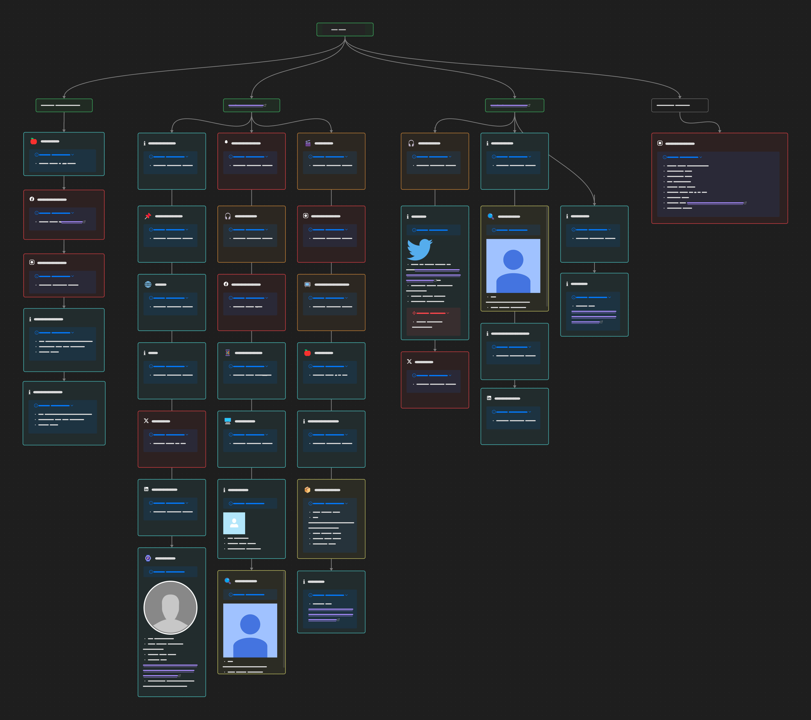

# OSINT.Industries Canvas Visualizer

A specialized visualization tool for [OSINT.Industries](https://osint.industries) CSV exports, transforming digital footprint results into an organized Obsidian Canvas format.

## About

This tool is specifically designed to work with CSV exports from OSINT.Industries platform. It converts the detailed social media presence and account information into a visually organized Obsidian Canvas, making it easier to analyze and understand digital footprints.

## Requirements

### Python Version
- Python 3.7 or higher

### Required Packages
```bash
pip install python-dateutil requests pandas chardet
```

## Installation

Clone the repository:
```bash
git clone https://github.com/yourusername/osint-industries-canvas.git
cd osint-industries-canvas
```

## Usage

1. Export your results from OSINT.Industries as CSV
2. Run the script with your export:
```bash
python osint_industries_canvas.py your_export.csv
```

The script will generate an Obsidian Canvas file named `OSINT_Results_[timestamp].canvas`

## Supported Data

The tool supports all data points from OSINT.Industries exports, including:
- Account Detection
- Profile Information
- Platform-specific Data
- Breach Information
- Contact Details
- Profile Pictures
- Platform Metadata

## Supported Platforms

All platforms available on OSINT.Industries, including:
- 📱 Social Media (Facebook, Twitter, Instagram, LinkedIn)
- 🎮 Gaming (EA, Steam)
- 💼 Professional (GitHub, Dropbox)
- 🎵 Entertainment (Spotify, YouTube)
- 💬 Communication (Skype, Discord)
- And all other platforms supported by OSINT.Industries

## Screenshot




## Note

This tool is specifically designed for use with OSINT.Industries exports. It may not work correctly with CSV files from other sources. Please ensure you're using a direct export from the OSINT.Industries platform.

## Contributing

Contributions are welcome! Please feel free to submit a Pull Request.

## License

This project is licensed under the MIT License - see the [LICENSE](LICENSE) file for details.

## Acknowledgments

- [OSINT.Industries](https://osint.industries) for providing the comprehensive OSINT platform
- Obsidian for the Canvas feature that makes this visualization possible
